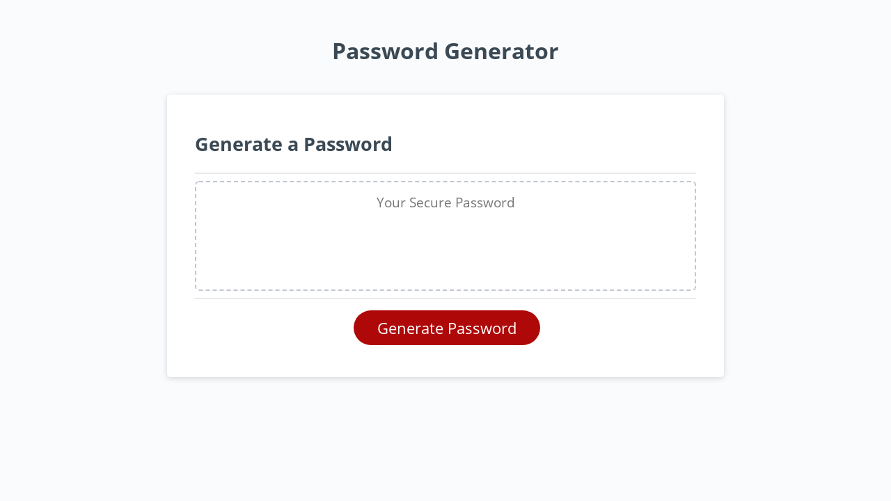

# Password Generator

## Description
This respository holds the code for an interactive password generator. 

## Usage
The homepage can be viewed via Github pages using the following link: [Password Generator](https://djamz919.github.io/password-generator/)

By inputting the password length, and the criteria for character selection (lowercase, uppercase, numbers, and special characters), a user can have a secure password randomly generated.

